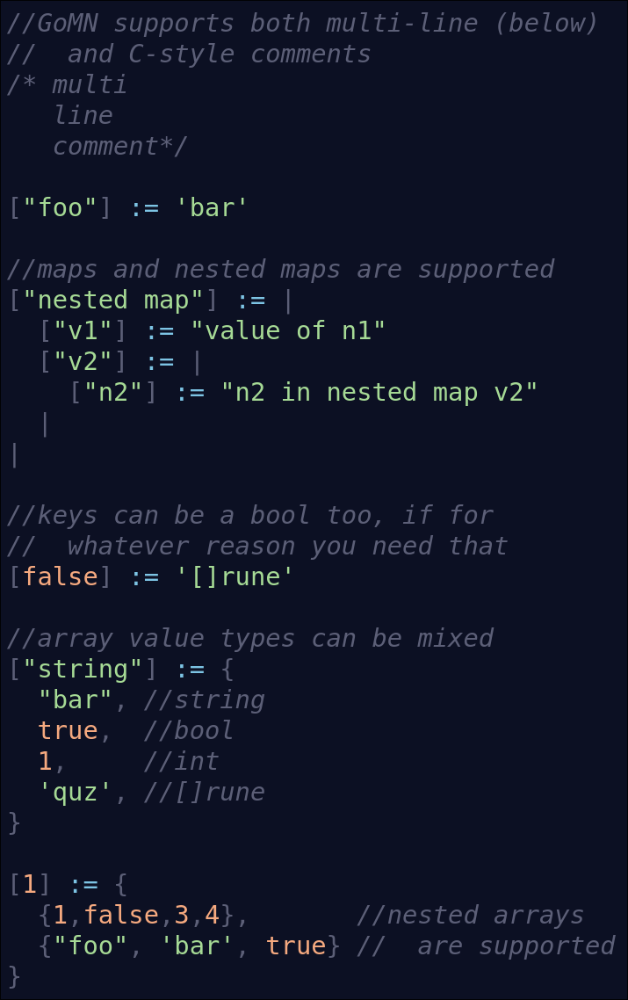

# GoMN (Go Map Notation)

Why? Great question.

>[!WARNING]
>GoMN is experimental, and isn't trying to be serious. This project is purely an exercise of programming fun 

---

Better documentation will be made if this project is ever deamed "complete." For now, please read the `test.gomn` file to see more about it. 
